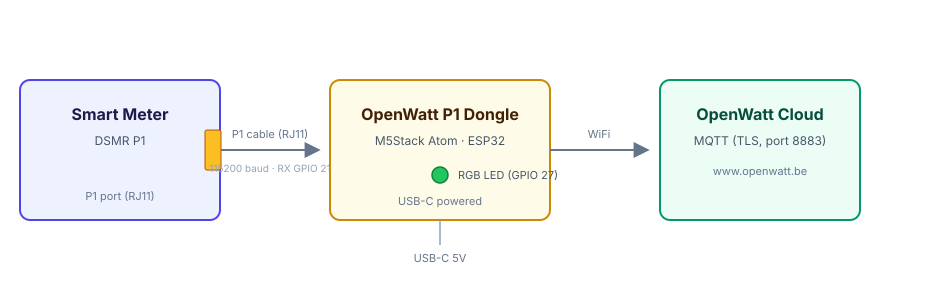

# Hardware

## Dongle

The OpenWatt P1 dongle is an **ESP32** module in an **M5Stack Atom** form
factor, with a single RGB LED, a USB-C port, and a P1 (RJ11) connector.

> 🖼️ **Photo placeholder** — add a product photo of the dongle at
> `docs/images/dongle-photo.png` and reference it here with:
> ``

## Connection to the meter

The dongle connects to the **P1 port** (RJ11) of the smart meter and is powered
over USB-C. Data flows from the meter to the dongle, then over WiFi to the
OpenWatt cloud.

> 🖼️ **Photo placeholder** — add a photo of the dongle plugged into a meter at
> `docs/images/install-photo.png` and reference it with:
> ``

## Pinout

| Signal | GPIO | Purpose |
|--------|------|---------|
| P1 RX | 21 | Receive DSMR telegram from meter (Serial1) |
| P1 TX | 22 | Transmit (request) to meter (Serial1) |
| P1 trigger | 25 | Request pin, held HIGH for continuous mode |
| LED | 27 | SK6812 RGB status LED |
| BOOT | 0 | Hold on reset to enter serial bootloader (flashing) |

P1 serial settings: **115200 baud, 8N1**.

## Buttons and reset

The firmware does **not** use a physical button for user actions. Relevant
controls are:

| Action | How |
|--------|-----|
| Flash firmware | Hold **BOOT** (GPIO 0) while resetting, then flash over USB |
| Factory reset | Web UI Settings → **Factory Reset**, or `PATCH /api/system/factory_reset` |
| Enter bootloader (remote) | `PATCH /api/system/bootloader` |

## Power

Powered over **USB-C** (5 V). No external power supply is required beyond a
standard USB-C adapter.

## History & attribution

The dongle hardware was originally developed by **Re.alto**, a subsidiary of
Belgian grid operator **Elia** (since closed). The design is pin-compatible
with, and inspired by, the open-source
[plan-d-io P1-dongle](https://github.com/plan-d-io/P1-dongle) project.
